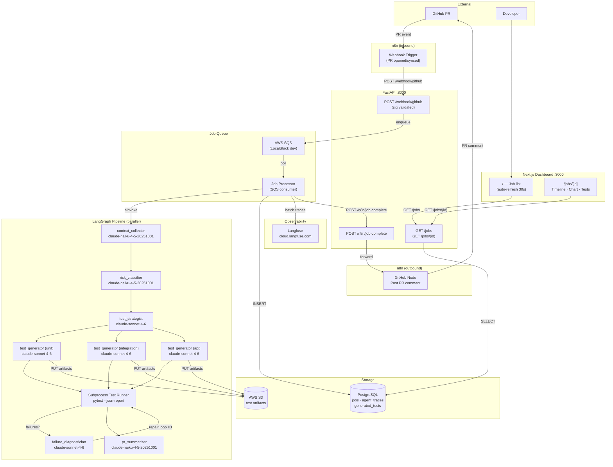

# TestPilot AI — System Architecture

## Component Summary

| Component | Technology | Purpose |
|---|---|---|
| FastAPI | Python 3.11, asyncpg, httpx | REST API, webhook ingestion, job creation |
| LangGraph | 0.2.x, asyncio.gather | Parallel agent orchestration |
| Anthropic SDK | claude-haiku / claude-sonnet | LLM calls (two-model routing) |
| PostgreSQL | asyncpg pool | Jobs, traces, generated tests |
| AWS SQS | LocalStack (dev) | Decoupled job queue |
| AWS S3 | LocalStack (dev) | Test artifact storage |
| Langfuse | Raw HTTP ingestion | LLM trace observability |
| n8n | Webhook + GitHub node | PR comment automation |
| Next.js 14 | App Router, Recharts | Real-time dashboard |

## Agent Routing

| Agent | Model | Parallelism |
|---|---|---|
| context_collector | claude-haiku-4-5-20251001 | sequential |
| risk_classifier | claude-haiku-4-5-20251001 | parallel with test parse |
| test_strategist | claude-sonnet-4-6 | sequential |
| test_generator ×3 | claude-sonnet-4-6 | parallel (unit/integration/api) |
| failure_diagnostician | claude-sonnet-4-6 | conditional, max 3 loops |
| pr_summarizer | claude-haiku-4-5-20251001 | sequential |
